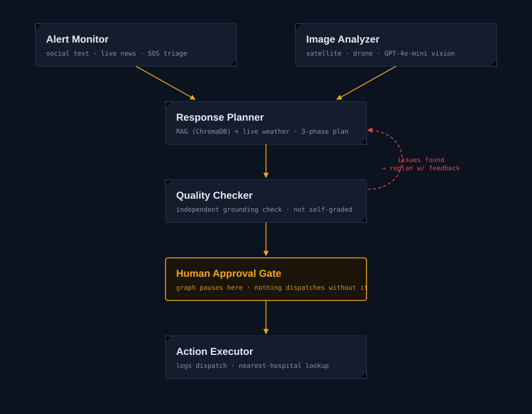

<p>
  
  
  
  
  
  
  
  
</p>

Genesis turns a chaotic disaster — SOS text, satellite imagery, weather, real emergency-response manuals — into one grounded, human-approved response plan. Five agents, one LangGraph state machine, real data at every step, containerized end to end.

## Table of contents

- [The problem](#the-problem)
- [What Genesis does](#what-genesis-does)
- [Architecture](#architecture)
- [Walking through one real incident](#walking-through-one-real-incident)
- [Real data sources](#real-data-sources)
- [Tech stack](#tech-stack)
- [Engineering decisions worth knowing about](#engineering-decisions-worth-knowing-about)
- [Known limitations](#known-limitations)
- [Project structure](#project-structure)
- [Setup](#setup)
- [Usage](#usage)
- [Running with Docker](#running-with-docker)
- [API reference](#api-reference)
- [Roadmap](#roadmap)

## The problem

When a disaster hits, the information that could save lives is scattered: SOS posts on social media, satellite imagery showing which roads are impassable, weather data on whether things are getting worse, and official response protocols nobody has time to read in the moment. Nobody is looking at all of it at once, so resources go to the wrong places and help arrives late.

## What Genesis does

Five agents, each with one job, coordinated by a LangGraph state machine:

| Agent                | Does                                                                                                                 | Built on                                        |
| -------------------- | -------------------------------------------------------------------------------------------------------------------- | ----------------------------------------------- |
| **Alert Monitor**    | Reads incoming SOS text (live news + historical replay) and classifies severity, disaster type, and location         | GPT-4o-mini, structured output                  |
| **Image Analyzer**   | Reads satellite/drone photos for flooding, blocked roads, and structural damage                                      | GPT-4o-mini vision, Copernicus EMS              |
| **Response Planner** | Retrieves real emergency-management protocols and drafts a 3-phase plan, grounded in retrieved text and live weather | RAG over ChromaDB, Open-Meteo                   |
| **Quality Checker**  | Independently verifies the plan didn't invent facts not present in the retrieved context or situation                | A second, separate LLM pass — never self-graded |
| **Action Executor**  | Logs the approved dispatch actions and looks up the nearest real hospital                                            | OpenStreetMap (Overpass, OSRM)                  |

Nothing dispatches without a human clicking approve — the graph physically pauses before Action Executor runs.

## Architecture



The retry loop isn't a blind re-roll: when Quality Checker finds unsupported claims, those specific issues are fed back into Response Planner's next attempt as an explicit correction instruction, capped at 3 retries before flagging for manual review rather than looping forever.

## Walking through one real incident

This is an actual run, not a hypothetical:

1. **Input:** `"Severe flooding reported in Assam, India"`
2. **Alert Monitor** classifies it: `disaster_type: flood`, `severity: high`, `location_hint: "Assam, India"`
3. **Image Analyzer** returns `no image provided` — none was attached, and it says so rather than guessing
4. **Response Planner** geocodes "Assam, India" to `26.4074°N, 93.2551°E`, pulls real weather for that point (`24.3°C, 0.0mm precipitation`), retrieves the most relevant chunks from 1,911 real NDMA/FEMA protocol passages, and drafts a 3-phase plan grounded in that retrieved text
5. **Quality Checker** independently compares the plan's claims against the retrieved context and the original situation text — passes only if nothing was invented
6. **Human approval gate** — the graph pauses; a person reviews the plan and clicks approve or reject
7. **Action Executor** logs the three dispatch actions and queries OpenStreetMap for the nearest real hospital to the incident coordinates, with real driving distance and time

## Real data sources

No sample data, no mock fallbacks — every source below is real and live-queried:

| Source                                                      | Used for                                                         | Access                                          |
| ----------------------------------------------------------- | ---------------------------------------------------------------- | ----------------------------------------------- |
| FEMA CPG 101 + 3 NDMA guidelines (flood/earthquake/cyclone) | Response Planner's grounding knowledge, 1,911 chunks in ChromaDB | Downloaded PDFs, chunked on sentence boundaries |
| Copernicus Emergency Management Service                     | Real satellite-derived disaster activation maps, any category    | Free public REST API, no key                    |
| Kaggle/HuggingFace disaster-tweets dataset                  | Alert Monitor's repeatable dev/eval replay source                | `datasets` library                              |
| Live news RSS                                               | Alert Monitor's real-time ingestion source                       | RSS feed                                        |
| Open-Meteo                                                  | Live weather at the incident's geocoded coordinates              | Free API, no key                                |
| OpenStreetMap Nominatim                                     | Geocoding place names to coordinates                             | Free API                                        |
| OSRM                                                        | Real driving distance/time to the nearest hospital               | Free public routing server                      |
| OpenStreetMap Overpass                                      | Finding real hospitals near any coordinate, globally             | Free API                                        |

## Tech stack

`Python` · `LangGraph` (agent orchestration + human-in-the-loop interrupts) · `OpenAI GPT-4o-mini` (text + vision) · `ChromaDB` (vector store) · `pydantic-settings` (typed config) · `SQLModel` + `SQLite` (persistence) · `FastAPI` (backend) · `Streamlit` (frontend) · `rasterio` (GeoTIFF processing) · `Docker` + `docker-compose` (containerized API + frontend, shared volume for persistent data)

## Engineering decisions worth knowing about

- **ChromaDB over Pinecone/Milvus/FAISS** — embedded, zero infra, same concepts transfer if scaling later becomes necessary.
- **No hardcoded Twitter/X dependency** — the paid API was dropped in favor of a pluggable ingestion pattern (dataset replay for dev/eval + live RSS), so the source can change without touching agent logic.
- **Quality Checker is a separate LLM call, not self-grading** — the plan's own `"grounded": true` field is deliberately not trusted; a second, independent pass looks specifically for unsupported claims.
- **Failed quality checks feed forward** — specific issues found are passed back into the next planning attempt as correction instructions, not just retried blindly.
- **External API failures degrade gracefully, never crash the pipeline** — GDELT/Overpass rate limits and timeouts are retried with exponential backoff, then fail into `None`/empty rather than raising, since a flaky map lookup shouldn't block dispatching a life-safety plan.
- **Sentence-boundary chunking, not fixed-character slicing** — an early version cut protocol text mid-word; chunks are now built on real sentence boundaries.
- **GeoTIFF nodata handling** — Copernicus satellite rasters use `NaN` sentinel values for "no data" pixels; naive normalization produced blank images until nodata was explicitly masked out.
- **No SMS/email dispatch integration** — deliberately scoped out. It would demonstrate third-party API plumbing, not the agentic/RAG/evals architecture this project is actually about.
- **Real data mounted as Docker volumes, not baked into the image** — ChromaDB and SQLite live in `./data`, mounted at runtime, so rebuilding the image never wipes real ingested data.

## Known limitations

Documented honestly, not hidden:

- Copernicus EMS rasters are frequently SAR (radar) data, not optical photos — a vision LLM can describe pixel patterns but can't reliably read disaster damage from raw radar backscatter the way it can from a normal photo.
- Nearest-hospital lookup checks only the first 5 unsorted Overpass results within a fixed radius — not a guaranteed true-nearest search.
- Live RSS coverage depends on the specific feed(s) configured — narrower than an aggregator like GDELT, traded for reliability.
- Geocoding precision is only as specific as the location text extracted — a broad region name resolves to that region's centroid, not a street-level point, which is the geocoder's correct behavior, not a bug.

## Project structure

```text
genesis-ai/
├── data/
│   └── raw/protocols/        real FEMA/NDMA PDFs
├── notebooks/                 Phase 1 prototyping (vision, triage, orchestration, RAG)
├── src/
│   ├── config.py               typed settings (pydantic-settings)
│   ├── main.py                  CLI entrypoint
│   ├── agents/
│   │   ├── state.py             shared GenesisState
│   │   ├── graph.py             LangGraph wiring, retry loop, approval interrupt
│   │   ├── alert_monitor.py
│   │   ├── image_analyzer.py
│   │   ├── response_planner.py
│   │   ├── quality_checker.py
│   │   └── action_executor.py
│   ├── tools/
│   │   ├── vision_tool.py
│   │   ├── weather_tool.py
│   │   ├── maps_tool.py
│   │   ├── copernicus_tool.py
│   │   ├── dataset_tool.py
│   │   └── rss_tool.py
│   ├── rag/
│   │   ├── chroma_client.py
│   │   ├── build_knowledge_base.py
│   │   └── search_knowledge_base.py
│   ├── db/
│   │   ├── models.py
│   │   └── session.py
│   └── api/
│       ├── app.py
│       ├── schemas.py
│       └── routes/
│           ├── incidents.py
│           └── health.py
├── streamlit_app.py            frontend, calls the FastAPI backend
├── docker/
│   └── Dockerfile
├── docker-compose.yml
├── requirements.txt
├── .dockerignore
└── docs/assets/                 README graphics
```

## Setup

```bash
git clone <your-repo-url>
cd genesis-ai
python -m venv llm_env
llm_env\Scripts\activate        # Windows
pip install -r requirements.txt

cp .env.example .env
# fill in OPENAI_API_KEY at minimum
```

Build the knowledge base once, before first run:

```bash
python -m src.rag.build_knowledge_base
```

## Usage

**CLI — run one incident end to end:**

```bash
python -m src.main "Severe flooding reported in Assam, India"
```

**API + frontend locally — run both, in separate terminals:**

```bash
uvicorn src.api.app:app --reload
streamlit run streamlit_app.py
```

## Running with Docker

```bash
docker compose build
docker compose up -d
docker compose exec api python -m src.rag.build_knowledge_base   # one-time, populates the mounted volume
```

Then visit `http://localhost:8501` (Streamlit) and `http://localhost:8000/docs` (FastAPI's interactive docs). Both services share `./data` as a mounted volume, so ChromaDB and the SQLite incident log persist across rebuilds instead of resetting.

## API reference

| Endpoint                         | Method | Does                                                                         |
| -------------------------------- | ------ | ---------------------------------------------------------------------------- |
| `/health`                        | GET    | Liveness check                                                               |
| `/incidents`                     | POST   | Starts an incident, runs through the human-approval pause                    |
| `/incidents/{thread_id}/approve` | POST   | Resumes a paused incident with an approve/reject decision, saves to database |

## Roadmap

- [ ] LangSmith tracing — full observability into each node's execution
- [ ] Ragas evaluation suite — measured Faithfulness/Relevancy over a fixed test set

<br/>


